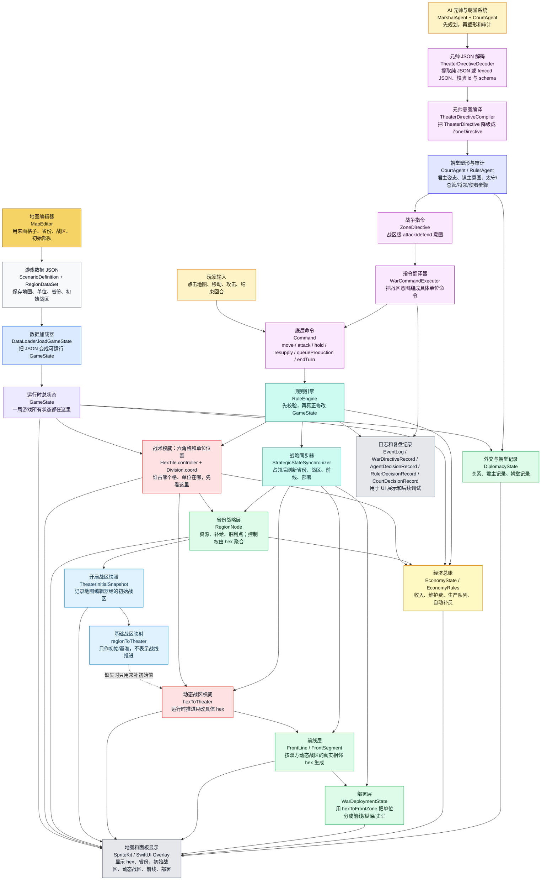
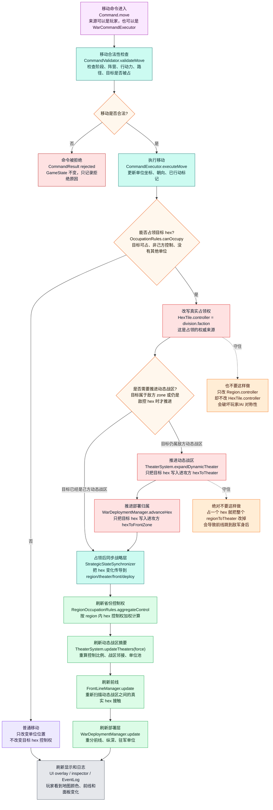
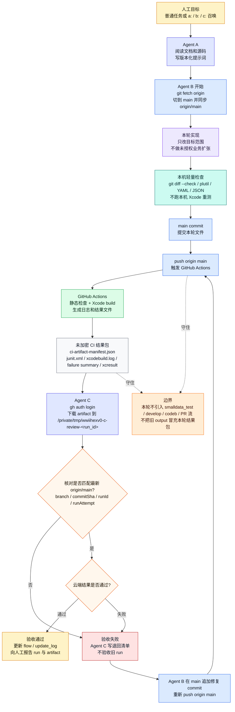
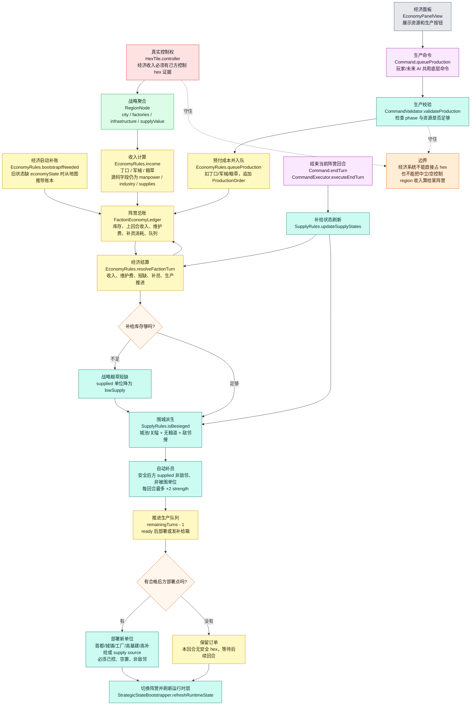
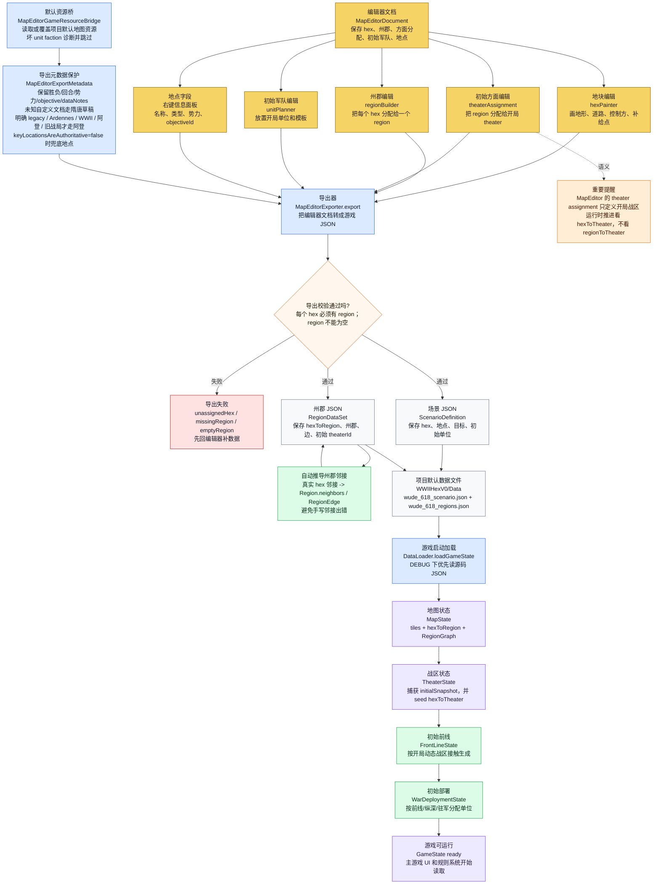
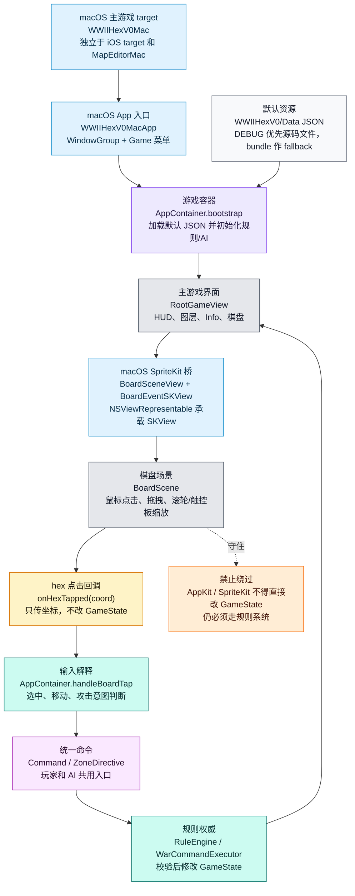
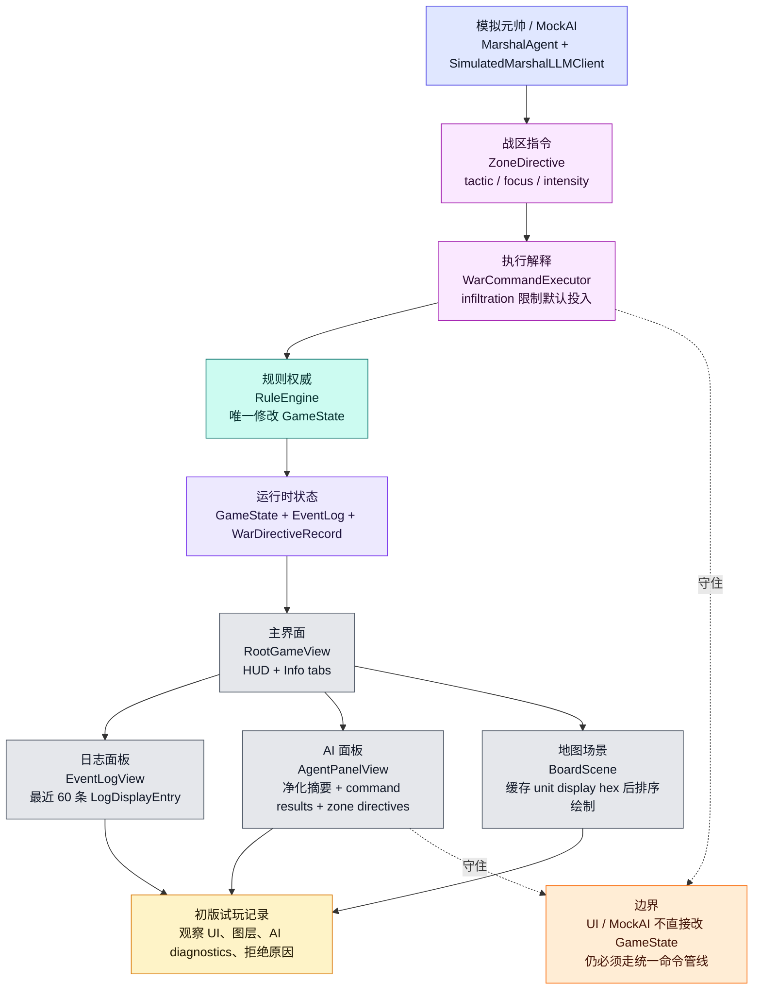

# WWIIHexV0 Mermaid 核心流程图

> 本图参照 `md/flow/flow.md`。每个图块都用“中文解释 + 关键代码名”标注：先看中文理解逻辑，再用代码名回到源码定位。

## 0. 读图总纲

项目当前最重要的逻辑是：

```text
地图编辑器/JSON 数据
  -> 游戏启动加载为 GameState
  -> hex 是真实战术权威
  -> region / theater / front / deploy 都是从 hex 和单位位置派生出来的战略层
  -> economy 是 faction 级经济总账，收入仍从真实控制的 hex/region 聚合
  -> v3.4 朝堂层塑形和审计战略意图，不替代战术权威
  -> 玩家和 AI 都必须把命令交给 RuleEngine
  -> 命令执行后再同步刷新战略层和 UI
```

图里颜色含义：

- 红色：权威状态，不能被下游反向覆盖。
- 绿色：派生状态，可以重建，但来源必须清楚。
- 蓝色：初始快照/基准状态，不是运行时推进状态。
- 紫色：命令管线，玩家、AI、未来聊天命令都要走这里。

## 0.1 v3.0-v3.7-preflight.114 隋唐迁移入口

这张图说明当前迁移状态已推进到 v3.7-preflight.114；最近几轮收口动态方面推进势力兜底、RegionDataSet owner/controller 兜底、场景语义 helper、胜负 fallback 门禁、MapEditor unit faction 导入诊断、归附善后治安压力、贡赋效率、归附善后忠诚/叛乱/俘虏/安置只读审计、渡口港口粮道补给、MapEditor 河边数据保真、河边绘制入口、水路补给投送点、默认水路地点河边资产、己控水路移动渡河减免、隔河近战水路控制校验、己控港口海港生产部署点、己控港口海港战略补给源、玩家可见接触态势术语古代化和骑兵基础冲击强化，让异常缺 zone 路径不再把推进方静默落到旧东路势力，非 legacy region 数据缺 owner 时不再静默落到旧西路势力，未知自定义场景不再静默套用旧胜负规则，MapEditor 坏 unit faction 也不再静默变成旧西路势力，归附交接后的善后风险会写入受影响州郡的治安/顺从状态并影响后续府库收入，同时记录忠诚压力、叛乱风险、俘虏整编数量和安置州郡候选；渡口/港口地点也会影响跨河补给成本、战术补给投送、相邻跨河移动成本、隔河近战校验、生产部署 fallback 和 region 战略补给源，MapEditor 默认资源读写和编辑入口也不再丢失 tile 河边，默认水路地点自身也具备 riverEdges 输入。

```mermaid
flowchart TD
    PROMPT["v3.0-v3.8 总提示词<br/>隋末唐初 AI Agent 历史策略迁移"]:::doc
    AUDIT["v3.0 审计合同<br/>v3.0_audit_and_contract.md<br/>硬编码扫描、迁移词汇表、P0/P1/P2/P3 优先级"]:::doc
    V31["v3.1 最小代码迁移<br/>Faction 新增隋唐势力<br/>GamePhase playerCommand / aiCommand<br/>DiplomacyState.isHostile / canAttack"]:::work
    V32["v3.2 默认数据迁移<br/>wude_618 90 hex / 36 region<br/>隋唐 unit templates / generals / power profiles<br/>DataLoader 优先加载隋唐路径"]:::work
    V33["v3.3 战争规则迁移<br/>ComponentType 新增隋唐兵种<br/>SupplyRules.isBesieged 派生围城<br/>战术和主要面板显示隋唐化"]:::work
    V34["v3.4 朝堂 AI 分层<br/>CourtAgent / RulerAgent<br/>君主、谋主、太守、总管、将领、使者审计<br/>DirectiveEnvelope 塑形后仍走 RuleEngine"]:::work
    V35["v3.5 玩家体验闭环<br/>战报摘要 / 外交中文化 / 州郡价值提示<br/>军令入口和交互日志中文化"]:::work
    V36["v3.6 UI 与地图视觉基底<br/>SuitangDesignTokens / suitangPanel<br/>HUD、军情入口、图层、将领档案中文化<br/>城池、关隘、粮仓、粮道、围城最小标识<br/>不改规则管线"]:::work
    V37["v3.7-preflight 胜负闭环<br/>VictoryRules 消费 wude_618 目标点<br/>洛阳 + 洛口仓 / 潼关 / 终局长安<br/>HUD 展示胜负原因"]:::work
    V37S["v3.7-preflight.2 局势生命周期<br/>GameSaveStore 本地 JSON<br/>启动继续存档<br/>命令 / AI 后自动保存<br/>新局 / 继续 / 重置"]:::work
    V37O["v3.7-preflight.3 发布候选前置面板<br/>HUD 筹备菜单<br/>开局引导 / 基础设置 / 发布前检查<br/>不改规则管线"]:::work
    V37W["v3.7-preflight.4 水路地点标识<br/>MapState.featureMarkers<br/>keyLocations -> 渡口 / 港口图标<br/>不改水战或补给规则"]:::work
    V37A["v3.7-preflight.5 AI 计划箭头<br/>recentDirectiveRecords<br/>非玩家 WarDirectiveRecord -> 虚线箭头 / 防守圈<br/>只读复盘记录"]:::work
    V37F["v3.7-preflight.6 前线墨线<br/>FrontLineState -> frontLineChains<br/>普通地图层墨线 / 朱色警示虚线<br/>只读前线派生状态"]:::work
    V37E["v3.7-preflight.7 存档错误反馈<br/>GameSaveStatus / AppContainer.saveStatus<br/>HUD 失败提示<br/>设置 / 发布检查显示详情"]:::work
    V37R["v3.7-preflight.8 发布说明与资产边界<br/>ReleaseChecklistView 发布说明<br/>代码绘制 / 派生显示口径<br/>运行时重测未授权"]:::work
    V37D["v3.7-preflight.9 外交命令闭环<br/>Command.updateDiplomacy<br/>议和 / 纳降 -> RuleEngine<br/>只改 DiplomacyState"]:::work
    V37G["v3.7-preflight.10 州郡经营闭环<br/>Command.governRegion<br/>修道 / 屯田 / 安民 -> RuleEngine<br/>只改 RegionNode 与府库"]:::work
    V37AG["v3.7-preflight.11 AI 太守主动经营<br/>CourtRecord governor focus -> Command.governRegion<br/>AI 回合最多一条经营命令<br/>仍经 RuleEngine"]:::work
    V37AD["v3.7-preflight.12 AI 使者主动外交<br/>保守条件 -> Command.updateDiplomacy<br/>AI 回合最多一条停战 / 归附关系命令<br/>仍经 RuleEngine"]:::work
    V37SE["v3.7-preflight.13 归附事件记录链<br/>Command.updateDiplomacy -> DiplomacyEventRecord<br/>外交战报关联 relatedRecordId<br/>不做地图 / 军队交接"]:::work
    V37ST["v3.7-preflight.14 归附空势力轮转收口<br/>submitted target + 无存活军队 + 无受控可通行 hex<br/>退出通用隋唐回合轮转<br/>不做地图 / 军队交接"]:::work
    V37SP["v3.7-preflight.15 归附实体盘点<br/>DiplomacyState submitted target helper<br/>外交面板显示残余军队 / 受控 hex<br/>不做地图 / 军队交接"]:::work
    V37SH["v3.7-preflight.16 归附实体交接命令<br/>Command.resolveSubmissionHandoff<br/>接管未毁灭军队 / 可通行受控 hex<br/>经 RuleEngine 执行"]:::work
    V37HA["v3.7-preflight.17 归附交接审计记录<br/>SubmissionHandoffRecord<br/>外交战报 relatedRecordId<br/>外交面板交接摘要"]:::work
    V37AH["v3.7-preflight.18 AI 归附实体交接<br/>TurnManager<br/>AI 回合最多一条 resolveSubmissionHandoff<br/>仍经 RuleEngine"]:::work
    V37AF["v3.7-preflight.19 归附善后压力记录<br/>SubmissionAftermathRecord<br/>外交日志 relatedRecordId<br/>外交面板善后摘要"]:::work
    V37AP["v3.7-preflight.20 AI 善后太守优先治理<br/>TurnManager aftermathGovernorRegionIds<br/>高/需安抚州郡 -> Command.governRegion<br/>仍经 RuleEngine"]:::work
    V37AGV["v3.7-preflight.21 善后处置审计记录<br/>SubmissionAftermathGovernanceRecord<br/>governRegion 成功后关联最新善后<br/>外交面板处置摘要"]:::work
    V37AGS["v3.7-preflight.22 善后处置进度摘要<br/>按 latest aftermath 聚合 governance records<br/>外交面板显示已处置 / 受影响州郡"]:::work
    V37AUP["v3.7-preflight.23 AI 善后未处置优先治理<br/>ungoverned aftermath regions 优先<br/>仍每回合最多一条 governRegion"]:::work
    V37AC["v3.7-preflight.24 善后完成状态提示<br/>外交面板显示待处置数量 / 完成状态<br/>完成后 AI 不再特殊优先该善后记录"]:::work
    V37RG["v3.7-preflight.25 发布检查门禁拆分<br/>ReleaseChecklistView 区分代码已接入 / 运行时未验证 / 后续功能<br/>不新增运行时结论"]:::work
    V37GD["v3.7-preflight.26 AI 太守跳过诊断<br/>TurnManager governorSkipDiagnostics<br/>无经营命令时记录原因"]:::work
    V37DD["v3.7-preflight.27 AI 使者/交接跳过诊断<br/>TurnManager diplomatSkipDiagnostics / submissionHandoffSkipDiagnostics<br/>无外交或交接命令时记录原因"]:::work
    V37ME["v3.7-preflight.28 MapEditor 默认隋唐资源桥<br/>默认读取 / 覆盖 wude_618<br/>导出保留胜负条件和水路地点元数据"]:::work
    V37MK["v3.7-preflight.29 MapEditor 地点字段化编辑<br/>MapEditorDocument.keyLocations<br/>删除派生地点写坐标抑制<br/>导出文档地点优先"]:::work
    V37SG["v3.7-preflight.30 发布候选静态门禁快照<br/>ReleaseChecklistView 只读 GameState<br/>展示地图/战线/外交/审计计数<br/>不代表运行时验收"]:::work
    V37LT["v3.7-preflight.31 玩家可见旧英文兜底收口<br/>legacy Faction / GamePhase / VictoryReason 显示中文化<br/>方向码与经济事件日志中文化<br/>不改 rawValue / schema"]:::work
    V37DT["v3.7-preflight.32 玩家可见调试文案收口（一）<br/>App/AI 记录与 bootstrap 战报中文化<br/>朝堂面板和将领技能显示收口<br/>不改命令 / AI / 规则"]:::work
    V37DC["v3.7-preflight.33 玩家可见外交/朝堂文案收口<br/>外交面板与君主摘要中文化<br/>详情面板和可访问性入口收口<br/>不改外交 / 命令 / 规则"]:::work
    V37AI["v3.7-preflight.34 玩家可见 AI 诊断文案收口<br/>AI 面板 / 方面诊断 / 命令结果中文化<br/>raw id 与工程词默认收口<br/>不改命令 / AI / 规则"]:::work
    V37BR["v3.7-preflight.35 战报与总管预览文案收口<br/>战报 metadata / 军议意图 / 预备军令摘要中文化<br/>raw record id 与工程格式默认收口<br/>不改日志 schema / 命令 / 规则"]:::work
    V37ES["v3.7-preflight.36 战报源头事件文案收口<br/>规则 / 军令 / 经济源头战报中文化<br/>region / theater raw id 默认收口<br/>不改命令 / 规则 / schema"]:::work
    V37UI["v3.7-preflight.37 App/UI 边界文案收口<br/>存档反馈 / 发布检查 / 详情面板中文化<br/>provider / scenario / raw id 默认收口<br/>不改存档 / 命令 / 规则"]:::work
    V38UX["v3.7-preflight.38 剩余 UI 文案抽样收口<br/>开局引导 / HUD / 朝堂面板中文化<br/>AI / Xcode / scenario fallback / raw JSON 收口<br/>战局复核 / 实机复核口径，不改规则 / 命令 / 存档"]:::work
    V39UX["v3.7-preflight.39 UI 文案复扫收口<br/>战局复核 / App 反馈 / 外交边界说明<br/>斜线 / N-M / 旧剧本 fallback 收口<br/>不改规则 / 命令 / 存档"]:::work
    V40PF["v3.7-preflight.40 本局执掌势力选择<br/>GameState.playerFaction / 设置页 picker / 本地存档<br/>通用 phase 按执掌势力判定<br/>不重排当前回合 / 不绕过规则"]:::work
    V41ME["v3.7-preflight.41 MapEditor 可见文案收口<br/>编辑器 picker / 状态 / 导出错误 / 地图短标中文化<br/>不改 JSON schema / rawValue / 规则管线"]:::work
    V42DN["v3.7-preflight.42 默认数据说明与补给战报中文化<br/>dataNotes / 加载战报 / 补给撤退事件中文化<br/>不改 schema / 加载顺序 / 规则数值"]:::work
    V43MS["v3.7-preflight.43 AI 元帅/方面军令摘要中文化<br/>元帅意图 / 方面军令摘要 / 可见诊断中文化<br/>不改 AI 决策 / schema / rawValue / 规则管线"]:::work
    V44LG["v3.7-preflight.44 Legacy MockAI 与元帅解析诊断中文化<br/>MockAI intent / reason / 解码错误 / 战报诊断净化<br/>不改 legacy heuristic / schema / rawValue / 规则管线"]:::work
    V45JD["v3.7-preflight.45 Legacy JSON 可见文本收口<br/>旧 fallback 场景 / 城邑 / 补给点 / 单位模板展示名中文化<br/>不改 schema / id / rawValue / 加载顺序"]:::work
    V46GP["v3.7-preflight.46 Legacy 将领档案可见文本收口<br/>军衔 / 履历 / 技能显示 / 总管展示名中文化<br/>不改 schema / id / skill rawValue / AI prompt"]:::work
    V47DE["v3.7-preflight.47 Agent 诊断与错误兜底文案收口<br/>角色显示 / 面板诊断净化 / 数据加载错误中文化<br/>不改 prompt / schema / rawValue / 规则管线"]:::work
    V48MF["v3.7-preflight.48 自动回合与元帅诊断兜底文案收口<br/>自动元帅展示 / legacy 映射失败 / 元帅异常原因中文化<br/>不改 prompt / schema / rawValue / 规则管线"]:::work
    V49DX["v3.7-preflight.49 数据加载与导出说明可见文案收口<br/>初始战报 / 州郡数据标题 / dataNotes 工程词中文化<br/>不改 schema / id / rawValue / 加载顺序"]:::work
    V50RP["v3.7-preflight.50 复核面板与记录摘要可见文案收口<br/>战局复核 / MapEditor / 战报 / 朝堂 / 外交展示净化<br/>不改 schema / id / rawValue / 规则管线"]:::work
    V51RI["v3.7-preflight.51 MapEditor 与主游戏 raw id 可见文案复扫<br/>坐标 / 文件名 / raw id / 方面防区 fallback 净化<br/>不改 schema / id / rawValue / 规则管线"]:::work
    V52CE["v3.7-preflight.52 命令错误与源头战报可见文案收口<br/>命令展示 / 错误兜底 / 源头战报 / raw agent id 净化<br/>不改 schema / id / rawValue / 规则管线"]:::work
    V53ZD["v3.7-preflight.53 总管与将领档案防区展示名收口<br/>自动总管 name / 将领档案所属防区 fallback<br/>不改 schema / id / assigned zone / 规则管线"]:::work
    V54LD["v3.7-preflight.54 legacy fallback 数据展示文案收口<br/>场景 / 地点 / 州郡 / 城邑 / 将领履历展示名<br/>不改 schema / id / rawValue / 加载顺序"]:::work
    V55UR["v3.7-preflight.55 legacy fallback 单位与防区展示文案收口<br/>单位名 / 阿登战局名 / 防区名<br/>不改 schema / id / rawValue / 加载顺序"]:::work
    V56SO["v3.7-preflight.56 legacy static fallback 目标兼容与展示文案收口<br/>静态阿登目标 / 单位 / 胜负原因中文化<br/>objective id 优先查找"]:::work
    V57LP["v3.7-preflight.57 legacy LLM prompt 语言收口<br/>旧 LocalLLM prompt / fallback 总管配置中文化<br/>保留 JSON schema 与命令合同"]:::work
    V58DP["v3.7-preflight.58 外交面板名称与记录净化收口<br/>势力 / 盟从展示 helper<br/>外交记录内部词与审计 id 净化"]:::work
    V59EL["v3.7-preflight.59 战报意图屏蔽与中文分类收口<br/>v3.x / 复合 intent 屏蔽<br/>中文战报分类关键词补齐"]:::work
    V60ME["v3.7-preflight.60 MapEditor 导出元数据 fallback 收口<br/>未知自定义文档默认隋唐草稿<br/>明确 legacy / Ardennes / WWII 才阿登"]:::work
    V61AP["v3.7-preflight.61 AI 诊断净化口径对齐<br/>TurnManager 源头 + AgentPanel 展示<br/>model / legacy pipeline / RuleEngine 语义统一<br/>常见审计 id 净化补齐"]:::work
    V62LG["v3.7-preflight.62 legacy 总管配置中文兜底<br/>general_agents.json 展示字段中文化<br/>GameAgent(definition:) 保护旧数据<br/>breakthrough traits 显示为突破"]:::work
    V63PI["v3.7-preflight.63 legacy prompt 内部编号分层<br/>AgentPromptBuilder 中文摘要优先<br/>内部编号单独列出<br/>保留 JSON 解析合同"]:::work
    V64PS["v3.7-preflight.64 legacy prompt 直通文本净化<br/>recentEvents / playerDirective 先净化<br/>raw id 与工程词不进自由文本<br/>内部编号和 schema 不变"]:::work
    V65PA["v3.7-preflight.65 legacy prompt 决策者身份净化<br/>systemPrompt 决策者展示名化<br/>personality 走 prompt 净化<br/>schema agentId 保留"]:::work
    V66MS["v3.7-preflight.66 legacy MockAI stance 文案收口<br/>AgentOrder.stance 中文化<br/>保留 type / id / parser 合同<br/>不改 MockAI 决策策略"]:::work
    V67PW["v3.7-preflight.67 legacy prompt 工程说明词收口<br/>hex / schema / Markdown 说明中文化<br/>保留 JSON 字段与 parser 合同"]:::work
    V68MJ["v3.7-preflight.68 模拟元帅输出纯 JSON 收口<br/>SimulatedMarshalLLMClient 不再包 Markdown 围栏<br/>decoder 仍兼容 fenced JSON"]:::work
    V69SH["v3.7-preflight.69 UI/战报/外交记录净化 helper 对齐<br/>先清 raw id 再替换工程词 / 模型词<br/>不改记录 schema / UI 布局 / 规则"]:::work
    V70GC["v3.7-preflight.70 legacy 将领与朝堂记录可见文案复扫<br/>装甲 / AI 自动回合 / JSON 标题收口<br/>不改 id / rawValue / rawJSON 字段"]:::work
    V71CM["v3.7-preflight.71 CommandPanel 命令消息展示净化<br/>lastCommandMessage 先清 raw id 再替换工程词 / 模型词<br/>不改状态存储 / 命令 / 规则"]:::work
    V72UT["v3.7-preflight.72 单位详情与提示 legacy 单位名收口<br/>UnitInspector / UnitTooltip 展示名净化<br/>同步 VoiceOver label / 不改 Division.name"]:::work
    V73RI["v3.7-preflight.73 州郡详情 legacy 地名与目标名收口<br/>RegionInspector 地名 / 要地 / 驻军展示净化<br/>不改地图数据 / objective / 动态归属"]:::work
    V74GP["v3.7-preflight.74 将领与总管面板 legacy 文案收口<br/>GeneralProfile / GeneralCommandPanel 展示名净化<br/>不改将领 / 防区 / 军队 / 预备军令数据"]:::work
    V75MA["v3.7-preflight.75 MapDisplayAdapter / SpriteKit 地图展示入口 legacy 文案收口<br/>地图标签 / objective / 详情既有 id 与势力展示兜底<br/>不改地图数据 / 状态合同 / 动态权威"]:::work
    V76ME["v3.7-preflight.76 MapEditor 选择器与状态消息 legacy 文案收口<br/>州郡 / 方面选择器 / 地点状态消息展示净化<br/>不改 MapEditor 文档 / 导出 JSON / id"]:::work
    V77AC["v3.7-preflight.77 AppContainer 交互日志与存档反馈 legacy 文案收口<br/>存档 / 选择 / 军队 / 防区 / 命令标题展示净化<br/>不改存档 schema / Command 合同 / 规则"]:::work
    V78EL["v3.7-preflight.78 GameLogEntry 源头战报 legacy 文案收口<br/>appendEvent / GameLogEntry message 源头净化<br/>不改 eventLog schema / relatedRecordId / 规则"]:::work
    V79PA["v3.7-preflight.79 legacy LocalLLM prompt 临时编号别名收口<br/>prompt 展示名净化 + 临时编号<br/>解析后回填真实 id / 不改 JSON 字段合同"]:::work
    V80MF["v3.7-preflight.80 legacy fallback 行军总管配置收口<br/>Guderian / legacy marshal fallback 中性化<br/>command_ id 前缀 / 不改 directive schema"]:::work
    V81CR["v3.7-preflight.81 朝堂/外交实际记录 id 展示净化<br/>ruler / court / diplomacy 实际 id 净化<br/>敌对国家计数文案 / 不改记录 schema"]:::work
    V82MT["v3.7-preflight.82 行军总管可见称谓净化<br/>Field Marshal / Guderian 显示收口<br/>directive/order/agent id 展示净化补齐"]:::work
    V83ST["v3.7-preflight.83 源头 legacy 中文势力/国家/地名净化<br/>源头展示文本收口<br/>不改 schema、规则、存档"]:::work
    V84GP["v3.7-preflight.84 将领档案/总管军令称谓对齐<br/>Field Marshal / Guderian 口径统一<br/>不改数据、规则、存档"]:::work
    V85FJ["v3.7-preflight.85 fallback JSON 可见数据文本收口<br/>场景 / 单位 / 地点 / 模板 / 将领可见字段<br/>不改 id、schema、规则、存档"]:::work
    V86SF["v3.7-preflight.86 源码层 legacy 可见兜底文本收口<br/>势力显示 / 胜负原因 / 数据校验错误<br/>不改 rawValue、schema、规则、存档"]:::work
    V87SM["v3.7-preflight.87 静态 GameState / MapState fallback 可见文本收口<br/>初始化战报 / 静态地图显示名复核<br/>不改 id、坐标、faction、规则、存档"]:::work
    V88OL["v3.7-preflight.88 legacy objective lookup 字面量收口<br/>胜负规则 / Region 胜负 / MockAI 目标查找<br/>id 优先 + 中性旧战局名 fallback<br/>不改胜负阈值、AI 策略、存档"]:::work
    V89RV["v3.7-preflight.89 RegionVictoryRules 隋唐胜负摘要对齐<br/>RegionRuleSystem 分析摘要按 scenarioId 分支<br/>wude_618 读取洛阳 / 洛口仓 / 潼关 / 长安<br/>不改主胜负执行、命令管线、存档"]:::work
    V90VE["v3.7-preflight.90 共享隋唐胜负 evaluator 收口<br/>VictoryAssessment / 规则层 Wude618VictoryEvaluator<br/>VictoryRules 与 RegionVictoryRules 复用<br/>不改 objective id、规则阈值、存档"]:::work
    V91CK["v3.7-preflight.91 指令结果语义化固守判定<br/>CommandResultSummary.commandKind<br/>ZoneCommanderAgent 按 .hold 判断<br/>不依赖 Hold / 展示名"]:::work
    V92PD["v3.7-preflight.92 阶段与旧总管展示口径<br/>GamePhase 朝堂行动 / 朝堂军令<br/>general_agents legacy 展示名历史总管<br/>不改 rawValue / legacy id / 规则"]:::work
    V93CS["v3.7-preflight.93 自动总管默认指挥风格<br/>ZoneCommanderAgent 多势力默认风格<br/>对齐 AppContainer 映射<br/>不改 directive / 规则 / 存档"]:::work
    V94CH["v3.7-preflight.94 默认指挥风格共享 helper<br/>CommandStyle.defaultForFaction<br/>两处生成入口复用<br/>不改 rawValue / Codable / 规则"]:::work
    V95DL["v3.7-preflight.95 DataLoader 场景阶段兜底<br/>无效 phase 隋唐默认玩家军令<br/>GameState / 战报 phase 复用<br/>不改 GamePhase rawValue / 规则"]:::work
    V96PN["v3.7-preflight.96 legacy phase 存档规范化<br/>GamePhase.normalized<br/>加载 / 校验 / 推进 / 自动回合复用<br/>保留合法 legacy rawValue"]:::work
    V97TF["v3.7-preflight.97 动态方面推进势力兜底<br/>WarCommandExecutor 不再 .germany fallback<br/>zone faction / 行动军队推断<br/>缺失则跳过并记录"]:::work
    V98RD["v3.7-preflight.98 RegionDataSet owner 兜底收口<br/>非 legacy 缺 owner 抛校验错误<br/>仅明确旧战局保留 .allies 兼容 fallback<br/>不改 JSON schema / 动态权威"]:::work
    V99SG["v3.7-preflight.99 场景语义与胜负门禁<br/>ScenarioSemantics 集中 legacy / wude618 / 草稿 / 自定义判断<br/>未知自定义不套 legacy 胜负 fallback"]:::work
    V100ME["v3.7-preflight.100 MapEditor unit faction 导入诊断<br/>非法 unit faction 跳过并记录诊断<br/>不再静默兜底 .allies<br/>不改 JSON schema / 主游戏 DataLoader"]:::work
    V101AP["v3.7-preflight.101 归附善后治安压力<br/>SubmissionAftermathRecord 风险等级<br/>写入州郡 OccupationState<br/>不新增忠诚 / 叛乱 / 贡赋 / 俘虏 / 安置模型"]:::work
    V102TE["v3.7-preflight.102 归附善后贡赋效率<br/>OccupationState 折算州郡收入<br/>高抵抗降贡赋 / 安民后恢复<br/>不新增命令 / 存档 schema"]:::work
    V103WS["v3.7-preflight.103 渡口港口粮道补给<br/>SupplyRules 跨河补给成本<br/>水路通行点免除渡河额外成本<br/>不改移动 / 战斗 / schema"]:::work
    V104RE["v3.7-preflight.104 MapEditor 河边保真<br/>MapEditorHex 保存 riverEdges<br/>导入导出稳定往返<br/>不加编辑 UI / 不自动镜像"]:::work
    V105RU["v3.7-preflight.105 MapEditor 河边编辑<br/>地块模式绘制 / 擦除河边<br/>画布蓝线和信息面板反馈<br/>不自动镜像 / 不改运行时规则"]:::work
    V106SA["v3.7-preflight.106 水路补给投送点<br/>己控渡口 / 港口 / 海港<br/>并入 SupplyRules anchor<br/>不改 MapState supplySources / 部署点"]:::work
    V107RE["v3.7-preflight.107 水路地点河边资产<br/>蒲津渡 / 孟津渡 / 洛口津补录 riverEdges<br/>四个默认水路地点自身河边非空<br/>不改运行时规则 / 不双写邻边"]:::work
    V108WM["v3.7-preflight.108 移动渡河减免<br/>己控渡口 / 港口 / 海港<br/>免除相邻非道路跨河移动额外成本<br/>不改补给 / 战斗 / 水战 / schema"]:::work
    V109PD["v3.7-preflight.109 港口部署点<br/>己控港口 / 海港<br/>生产完成安全部署 fallback<br/>不改 SupplySource / 水战 / schema"]:::work
    V110PS["v3.7-preflight.110 港口战略补给源<br/>己控港口 / 海港所在州郡<br/>并入 RegionSupplyRules sources<br/>不写 MapState supplySources"]:::work
    V111AF["v3.7-preflight.111 善后四类审计<br/>忠诚压力 / 叛乱风险<br/>俘虏整编 / 安置州郡<br/>只读记录和外交面板展示"]:::work
    V112WA["v3.7-preflight.112 隔河近战校验<br/>无远程支援跨河攻击<br/>需要己控渡口 / 港口 / 海港<br/>不实现完整水战"]:::work
    V113AT["v3.7-preflight.113 接触态势术语<br/>玩家可见前线 / 战线口径古代化<br/>底层 FrontLine 兼容名保留"]:::work
    V114CV["v3.7-preflight.114 骑兵冲击强化<br/>骑兵攻击 / 移动提高<br/>平原冲击加成提高"]:::work
    CURRENT["当前运行时状态<br/>主游戏默认优先 wude_618<br/>失败 fallback Ardennes<br/>MapEditor 默认桥指向 wude_618"]:::state
    LATER["v3.7+<br/>实际叛乱 / 俘虏处置 / 安置命令<br/>水战 / 更细水域控制<br/>真实模型接入、完整发布运行时重测"]:::work
    RULE["持续边界<br/>Command / ZoneDirective -> WarCommandExecutor -> RuleEngine<br/>hex 与动态映射仍是权威"]:::rules

    PROMPT --> AUDIT --> V31 --> V32 --> V33 --> V34 --> V35 --> V36 --> V37 --> V37S --> V37O --> V37W --> V37A --> V37F --> V37E --> V37R --> V37D --> V37G --> V37AG --> V37AD --> V37SE --> V37ST --> V37SP --> V37SH --> V37HA --> V37AH --> V37AF --> V37AP --> V37AGV --> V37AGS --> V37AUP --> V37AC --> V37RG --> V37GD --> V37DD --> V37ME --> V37MK --> V37SG --> V37LT --> V37DT --> V37DC --> V37AI --> V37BR --> V37ES --> V37UI --> V38UX
    V38UX --> V39UX --> V40PF --> V41ME --> V42DN --> V43MS --> V44LG --> V45JD --> V46GP --> V47DE --> V48MF --> V49DX --> V50RP --> V51RI --> V52CE --> V53ZD --> V54LD --> V55UR --> V56SO --> V57LP --> V58DP --> V59EL --> V60ME --> V61AP --> V62LG --> V63PI --> V64PS --> V65PA --> V66MS --> V67PW --> V68MJ --> V69SH --> V70GC --> V71CM --> V72UT --> V73RI --> V74GP --> V75MA --> V76ME --> V77AC --> V78EL --> V79PA --> V80MF --> V81CR --> V82MT --> V83ST --> V84GP --> V85FJ --> V86SF --> V87SM --> V88OL --> V89RV --> V90VE --> V91CK --> V92PD --> V93CS --> V94CH --> V95DL --> V96PN --> V97TF --> V98RD --> V99SG --> V100ME --> V101AP --> V102TE --> V103WS --> V104RE --> V105RU --> V106SA --> V107RE --> V108WM --> V109PD --> V110PS --> V111AF --> V112WA --> V113AT --> V114CV --> CURRENT
    V37MK --> LATER
    RULE --> LATER
    RULE --> V31
    RULE --> V32
    RULE --> V33
    RULE --> V34
    RULE --> V35
    RULE --> V36
    RULE --> V37
    RULE --> V37S
    RULE --> V37O
    RULE --> V37W
    RULE --> V37A
    RULE --> V37F
    RULE --> V37E
    RULE --> V37R
    RULE --> V37D
    RULE --> V37G
    RULE --> V37AG
    RULE --> V37AD
    RULE --> V37SE
    RULE --> V37ST
    RULE --> V37SP
    RULE --> V37SH
    RULE --> V37HA
    RULE --> V37AH
    RULE --> V37AF
    RULE --> V37AP
    RULE --> V37AGV
    RULE --> V37AGS
    RULE --> V37AUP
    RULE --> V37AC
    RULE --> V37RG
    RULE --> V37GD
    RULE --> V37DD
    RULE --> V37ME
    RULE --> V37DT
    RULE --> V37DC
    RULE --> V37AI
    RULE --> V37BR
    RULE --> V37ES
    RULE --> V37UI
    RULE --> V38UX
    RULE --> V39UX
    RULE --> V40PF
    RULE --> V41ME
    RULE --> V42DN
    RULE --> V43MS
    RULE --> V44LG
    RULE --> V47DE
    RULE --> V48MF
    RULE --> V49DX
    RULE --> V107RE
    RULE --> V108WM
    RULE --> V109PD
    RULE --> V110PS
    RULE --> V111AF
    RULE --> V112WA
    RULE --> V113AT
    RULE --> V114CV
    RULE --> V50RP
    RULE --> V51RI
    RULE --> V52CE
    RULE --> V53ZD
    RULE --> V54LD
    RULE --> V55UR
    RULE --> V56SO
    RULE --> V57LP
    RULE --> V58DP
    RULE --> V59EL
    RULE --> V60ME
    RULE --> V61AP
    RULE --> V62LG
    RULE --> V63PI
    RULE --> V64PS
    RULE --> V65PA
    RULE --> V66MS
    RULE --> V67PW
    RULE --> V68MJ
    RULE --> V69SH
    RULE --> V70GC
    RULE --> V71CM
    RULE --> V72UT
    RULE --> V73RI
    RULE --> V74GP
    RULE --> V75MA
    RULE --> V76ME
    RULE --> V77AC
    RULE --> V78EL
    RULE --> V79PA
    RULE --> V80MF
    RULE --> V81CR
    RULE --> V82MT
    RULE --> V83ST
    RULE --> V84GP
    RULE --> V85FJ
    RULE --> V86SF
    RULE --> V87SM
    RULE --> V88OL
    RULE --> V89RV
    RULE --> V90VE
    RULE --> V91CK
    RULE --> V92PD
    RULE --> V93CS
    RULE --> V94CH
    RULE --> V95DL
    RULE --> V96PN
    RULE --> V97TF
    RULE --> V98RD
    RULE --> V99SG
    RULE --> V100ME

    classDef doc fill:#fef3c7,stroke:#d97706,color:#1f1600
    classDef state fill:#ede9fe,stroke:#7c3aed,color:#1f143d
    classDef work fill:#dbeafe,stroke:#2563eb,color:#0f172a
    classDef rules fill:#ccfbf1,stroke:#0f766e,color:#042f2e
```

## 1. 总主线：从地图数据到游戏行动

这张图看全局。左上是地图数据怎么进入游戏；中间是 hex、region、theater、front、deploy 的分层关系；右侧是玩家/AI 命令如何统一进入规则系统；底部是 UI 和日志怎么读取结果。



## 2. 占领与动态推进：一个单位移动后发生什么

这张图只看最容易出 bug 的链路：单位移动到敌控空格后，游戏如何占领这个 hex，并且只推进这个 hex 的动态战区和部署归属。

核心原则：占一个 hex，只改这个 hex 的 `hexToTheater` / `hexToFrontZone`；不能把整个 region 的 `regionToTheater` 改掉。



## 9. 协作云端验证闭环

这张图是协作制度，不是业务运行逻辑。业务源码仍按前面章节的 `Command / ZoneDirective -> RuleEngine` 执行；重验证默认交给 GitHub Actions，Agent C 通过未加密结果包验收。



## 3. v0.8 经济、生产与补员链路

这张图看 v0.8 初级经济。经济总账是 faction 级资源池，但收入和部署资格仍回到真实 hex 控制和 region 聚合；生产命令仍走 `RuleEngine`，UI 不直接改 `GameState`。



## 4. AI / 元帅与朝堂决策链：AI 怎么下命令

这张图看 v3.4 后默认 AI 主路径。AI 不直接控制单位，也不直接改地图；元帅先读取降维战场摘要，模拟 LLM 输出 `TheaterDirectiveEnvelope` JSON，经 decoder 校验和 compiler 降级后形成战区级 `DirectiveEnvelope`。朝堂层再记录君主、谋主、太守、行军总管、将领和使者步骤，并用 `RulerAgent` 塑形 directive。`WarCommandExecutor` 再把这些战术翻译成底层 `Command`，最后交给 `RuleEngine`。

当前默认 AI 主线是 `MarshalAgent -> TheaterDirective JSON -> TheaterDirectiveDecoder -> TheaterDirectiveCompiler -> CourtAgent / RulerAgent -> ZoneDirective -> WarCommandExecutor -> RuleEngine`。旧 v0.37 `TheaterCommanderPool -> ZoneCommanderAgent` 作为 fallback 和显式 `.zoneDirective` 路径保留，也会进入 `CourtAgent` 审计和塑形。旧 Agent D 管线仍保留，但默认不走。

```mermaid
flowchart TD
    START["触发 AI 行动<br/>AppContainer.advanceOrRunAI / runAIIfNeeded<br/>玩家点下一回合，或命令后轮到 AI"]:::input
    CHECK{"当前阵营该由 AI 控制吗?<br/>phase 按 activeFaction / playerFaction 规范化<br/>玩家势力仅观察者模式代跑，其他 AI 势力可自动行动"}:::decision
    STOP["不运行 AI<br/>等待玩家操作或阶段切换"]:::stop
    REFRESH["行动前刷新运行时战略层<br/>StrategicStateBootstrapper.refreshRuntimeState<br/>避免 AI 读到旧前线/旧部署"]:::rules
    TM["AI 回合编排器<br/>TurnManager.runAITurn<br/>默认 pipelineMode = marshalDirective"]:::rules
    SUM["战场摘要<br/>MarshalBattlefieldSummarizer<br/>只给元帅 front/deploy/目标/补给摘要，不给全量 hex"]:::ai
    LLM["模拟 LLM 客户端<br/>SimulatedMarshalLLMClient<br/>输出纯 JSON，不接真实网络或模型"]:::ai
    DEC["元帅 JSON 解码器<br/>TheaterDirectiveDecoder<br/>提取 JSON、解码、校验 schema/zone/region/tactic"]:::command
    COMP["元帅意图编译器<br/>TheaterDirectiveCompiler<br/>TheaterDirective -> ZoneDirective<br/>传递 focus/convergence/coordinated 参数"]:::command
    ENV["指令信封<br/>DirectiveEnvelope<br/>收集编译后的 ZoneDirective"]:::command
    COURT["朝堂分层<br/>CourtAgent.deliberate<br/>君主、谋主、太守、总管、将领、使者步骤"]:::ai
    RULER["君主塑形<br/>RulerAgent.adjust<br/>调整姿态、强度、预备队倾向<br/>保留 focus/support/convergence 参数"]:::ai
    TACTIC["高级战术路由<br/>TacticName<br/>疾骑突进 / 突骑破阵 / 破阵 / 合围<br/>弓弩压制 / 佯动 / 袭扰截粮 / 固守"]:::command
    WCE["指令执行器<br/>WarCommandExecutor.execute<br/>按战术 profile 选择单位、目标和 fallback"]:::command
    BOTTOM["具体单位命令<br/>Command<br/>attack / move / hold / allowRetreat"]:::command
    RE["统一规则校验执行<br/>RuleEngine<br/>AI 和玩家共用同一套规则"]:::rules
    RECORD["指令与朝堂复盘记录<br/>WarDirectiveRecord + RulerDecisionRecord + CourtDecisionRecord<br/>记录 tactic、target、结果、拒绝原因和朝堂步骤"]:::ui
    END["AI 自动结束回合<br/>RuleEngine.execute(.endTurn)<br/>切换 activeFaction / phase"]:::rules

    START --> CHECK
    CHECK -->|否| STOP
    CHECK -->|是| REFRESH --> TM --> SUM --> LLM --> DEC --> COMP --> ENV --> COURT --> RULER
    RULER --> TACTIC --> WCE --> BOTTOM --> RE --> RECORD --> END

    FALLBACK["Fallback 将军池<br/>TheaterCommanderPool + ZoneCommanderAgent<br/>元帅 JSON 无效或某 zone 无指令时使用"]:::ai
    DEC -.解码失败.-> FALLBACK --> ENV
    COMP -.zone 缺指令.-> FALLBACK

    LEGACY["旧 Agent D 管线<br/>AgentContext -> DecisionProvider -> AgentCommandMapper<br/>只在 legacyAgentOrder 显式分支或测试中使用"]:::legacy
    TM -.默认不走.-> LEGACY

    MANUAL["手写战区指令<br/>手工 ZoneDirective<br/>玩家聊天命令也可以直接指定 tactic/focus/convergence"]:::input
    MANUAL --> ENV

    classDef input fill:#fef3c7,stroke:#d97706,color:#1f1600
    classDef decision fill:#fff7ed,stroke:#ea580c,color:#1f1300
    classDef stop fill:#fee2e2,stroke:#b91c1c,color:#111827
    classDef rules fill:#ccfbf1,stroke:#0f766e,color:#042f2e
    classDef ai fill:#e0e7ff,stroke:#4f46e5,color:#111827
    classDef command fill:#fae8ff,stroke:#a21caf,color:#2a0a2f
    classDef ui fill:#e5e7eb,stroke:#4b5563,color:#111827
    classDef legacy fill:#f3f4f6,stroke:#6b7280,stroke-dasharray:5 5,color:#111827
```



## 5. MapEditor 到游戏数据：地图怎么进入主游戏

这张图看地图编辑器的输出链路。编辑器里画的是初始地图和初始战区；运行时动态战区仍由游戏里的 `hexToTheater` 推进，不是编辑器脚本控制。



## 6. v1.1 主游戏 macOS 入口

这张图只说明 v1.1 新增的 macOS 主游戏 target。它复用主游戏数据、UI、SpriteKit 棋盘和规则系统；macOS 输入只是平台桥接，不是新的规则入口。



## 7. v1.0 UI / AI / 初版试玩链路

这张图说明 v1.0 分支的收口点：它不新增规则入口，只改善 UI 可读性、AI 回放、轻量性能和试玩记录。



## 8. v0.4 将军与玩家双轨命令

这张图说明 v0.4 分支的新增主线：实体将军从 JSON / region 种子接入 FrontZone；玩家可以微操具体部队，也可以通过将军面板发战区宏观命令。两条路最终仍收口到规则系统。

```mermaid
flowchart TD
    GJSON["将军数据<br/>generals.json<br/>六位历史将军、倾向、技能、忠诚/满意度"]:::data
    RJSON["Region 种子<br/>ardennes_v02_regions.assignedGeneralId<br/>开局指定某 region 所属将军"]:::data
    DL["加载器<br/>DataLoader.loadGeneralRegistry<br/>读取 GeneralRegistry"]:::loader
    DISP["将军指派器<br/>GeneralDispatcher.assignGenerals<br/>种子 -> 偏好 -> 同阵营后备池"]:::rules
    FZ["战区部署<br/>FrontZone.generalAssignment<br/>generalId、HQ region、辖下 division、忠诚/满意度"]:::state
    POOL["将军池<br/>TheaterCommanderPool<br/>用 GeneralData 生成 ZoneCommanderAgentConfig"]:::ai

    TAP["玩家地图点击<br/>RootGameView / BoardScene<br/>选单位、选 region、选目标"]:::input
    MICRO["全微操<br/>AppContainer.submit(Command)<br/>move / attack / hold / resupply"]:::command
    LOCK["微操锁<br/>PlayerCommandState.micromanagedDivisionIds<br/>本回合玩家亲控单位"]:::state
    GENUI["将军面板<br/>GeneralCommandPanelView<br/>Hold Line / Attack Region"]:::ui
    ZD["玩家战区指令<br/>ZoneDirective<br/>defense holdLine 或 attack selected region"]:::command
    WCE["执行器<br/>WarCommandExecutor.execute(excluding lockedIds)<br/>跳过已微操单位"]:::command
    RE["规则权威<br/>RuleEngine<br/>校验并修改 GameState"]:::rules
    RECORD["记录<br/>WarDirectiveRecord + PlayerPlannedOperation<br/>AI 面板、日志、计划线共用"]:::ui
    BOARD["视觉反馈<br/>BoardScene<br/>进攻箭头、防御圆环、微操单位金色圈"]:::ui
    PROFILE["将军档案<br/>GeneralProfileView<br/>履历、技能、忠诚、满意度、辖下部队"]:::ui

    GJSON --> DL --> DISP
    RJSON --> DISP --> FZ --> POOL
    FZ --> GENUI --> PROFILE
    TAP --> MICRO --> RE --> LOCK
    LOCK --> WCE
    TAP --> GENUI --> ZD --> WCE --> RE --> RECORD --> BOARD
    FZ --> GENUI

    WARN["边界<br/>UI 和将军不直接改 hex / division<br/>行动必须走 Command 或 ZoneDirective"]:::warn
    GENUI -.守住.-> WARN
    WCE -.守住.-> WARN

    classDef data fill:#f8f9fb,stroke:#6b7280,color:#111827
    classDef loader fill:#dbeafe,stroke:#2563eb,color:#0f172a
    classDef state fill:#ede9fe,stroke:#7c3aed,color:#1f143d
    classDef ai fill:#e0e7ff,stroke:#4f46e5,color:#111827
    classDef input fill:#fef3c7,stroke:#d97706,color:#1f1600
    classDef command fill:#fae8ff,stroke:#a21caf,color:#2a0a2f
    classDef rules fill:#ccfbf1,stroke:#0f766e,color:#042f2e
    classDef ui fill:#e5e7eb,stroke:#4b5563,color:#111827
    classDef warn fill:#ffedd5,stroke:#f97316,color:#431407
```


